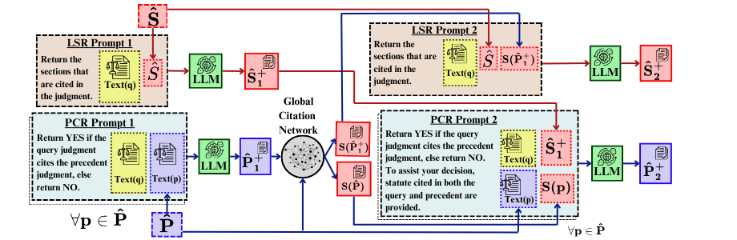

# IL-PCSR: Legal Corpus for Prior Case and Statute Retrieval

This project implements a sophisticated legal case retrieval system that combines traditional information retrieval (BM25), graph neural networks, and large language models for effective precedent and section retrieval.

[Insert System Architecture Image Here]

## Project Overview

The system uses a multi-stage approach to retrieve relevant legal precedents and sections:
1. Initial retrieval using BM25
2. Enhanced ranking using Graph Neural Networks
3. Final refinement using two-stage LLM prompting

## Setup and Installation

```bash
# Clone the repository
git clone [repository-url]

# Install requirements
pip install -r requirements.txt
```

## Dataset Preparation

1. Run the dataset preparation script:
```bash
python dataset.py
```
This script:
- Downloads the dataset from HuggingFace
- Converts it into the required format for processing
- Creates necessary directory structure

## Pipeline Steps

### 1. BM25 Initial Retrieval
```bash
python bm25.py
```
Performs initial retrieval for:
- Training queries
- Testing queries
- Development queries
Both for precedents and sections separately.

### 2. Generate Training Negatives
```bash
python utils_genrete_negatives_from_scores.py
```
Uses BM25 scores to generate negative samples for GNN training.

### 3. Generate Summaries
```bash
python utils_genrate_summaries.py
```
Generates summaries for the dataset using OpenAI's API.

### 4. Generate Embeddings
```bash
python utils_generate_queries_embeddings.py
python utils_generate_sections_embeddings.py
python utils_generate_precedents_embeddings.py
```
Creates embeddings for:
- Queries
- Precedents
- Sections
These embeddings are used in the GNN model.

### 5. Train Ensemble Models
```bash
# Train for precedents
python utils/train_paragnn_plus_bm25_for_precs.py

# Train for sections
python utils/train_paragnn_plus_bm25_for_secs.py
```

### 6. Testing
```bash
# Test precedent retrieval
python utils/test_paragnn_plus_bm25_for_precs.py

# Test section retrieval
python utils/test_paragnn_plus_bm25_for_secs.py
```

### 7. Calculate Scores
```bash
python utils/score_calculator.py
```
Converts rank lists to final scores.

### 8. LLM-based Refinement
```bash
# For precedents
python precs_first_stage_prompting.py
python precs_second_stage_prompting.py

# For sections
python secs_first_stage_prompting.py
python secs_secong_stage_prompting.py
```

## Project Structure

```
├── utils/
│   ├── bm25.py                           # BM25 retrieval implementation
│   ├── dataset.py                        # Dataset preparation utilities
│   ├── EUGATConv.py                      # Edge-updated GNN layer
│   ├── eugatgnn.py                       # GNN model implementation
│   ├── model.py                          # Main model architecture
│   ├── paragnn_plus_bm25_for_precs.py   # Ensemble model for precedents
│   ├── paragnn_plus_bm25_for_secs.py    # Ensemble model for sections
│   ├── score_calculator.py               # Score calculation utilities
│   ├── smart_summary.py                  # Summary generation using OpenAI
│   └── two_stage_prompting.py            # LLM prompting implementation
├── dataset/                              # Dataset files
├── embeddings/                           # Generated embeddings
├── scores/                              # Generated scores
└── requirements.txt                      # Project dependencies
```

## Data Format
The dataset is hosted on [HuggingFace](https://huggingface.co/datasets/Exploration-Lab/IL-PCSR). You can find all the details there.

## Model Components

### 1. BM25 Retrieval
Initial retrieval using BM25 algorithm for both precedents and sections.

### 2. Graph Neural Network
- Uses Edge-Updated Graph Attention Network (EUGAT)
- Incorporates document structure and relationships
- Trained on BM25-generated negative samples

### 3. Two-Stage LLM Prompting
- First stage: Initial relevance assessment
- Second stage: Refined ranking and relationship analysis


<p align="center">
  
</p>

The above diagram illustrates our two-stage LLM reranking process, where the system uses a sophisticated prompting strategy to refine the initial rankings from BM25 and GNN models.

## Citation

```bibtex
@inproceedings{il-pcsr2025,
  title = "IL-PCSR: Legal Corpus for Prior Case and Statute Retrieval",
  author = "Paul, Shounak and Ghumare, Dhananjay and Goyal, Pawan and Ghosh, Saptarshi and Modi, Ashutosh"
  booktitle = "Proceedings of the 2025 Conference on Empirical Methods in Natural Language Processing",
  month = nov,
  year = "2025",
  address = "Suzhou, China",
  publisher = "Association for Computational Linguistics",
  note = "To Appear"
}
```


